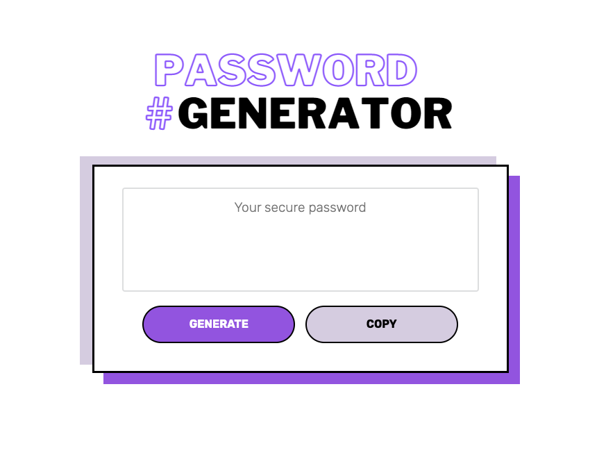

# Password Generator

## Description

This repository contains the source code for a password-generating web application. When the 'Generate' button is clicked, the user is required to answer a series of prompts to determine the password criteria (password length and character types to be included) before the password is generated and displayed in the textbox. There is also a 'Copy' button that allows the user to easily copy the generated password to their clipboard. 

## Screenshot

This is a screenshot of the deployed web application. 

## Link

[Link to deployed application](https://jkaho.github.io/password-generator/)
